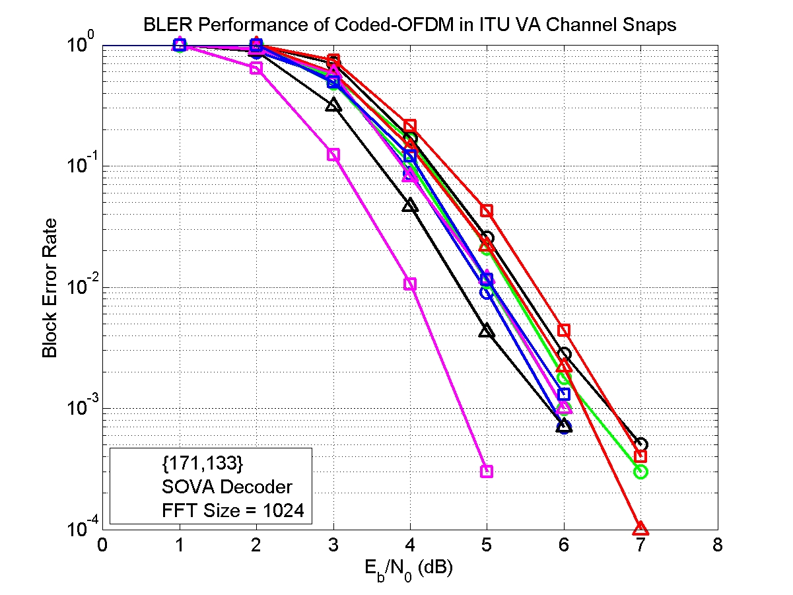

### Coded-OFDM, QPSK, Convolutional Code, ITU, VA Channel

* An (2,1,6) Convolutional code is simulated
* Decoding algorithm: SOVA decoding
* Interleaver: S-random Interleaver
* Modulation: QPSK with OFDM
* ITU Vehicular A Channel
* Fading channel: Jakes Rayleigh fading channel
* SISO case

#### Performance Evaluation

